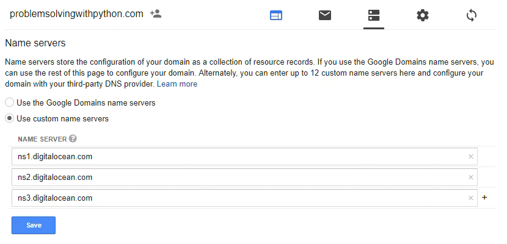
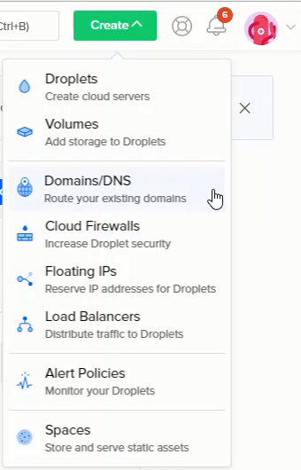
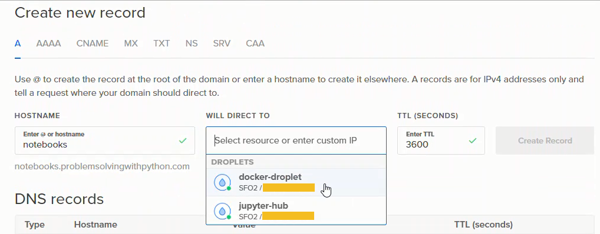
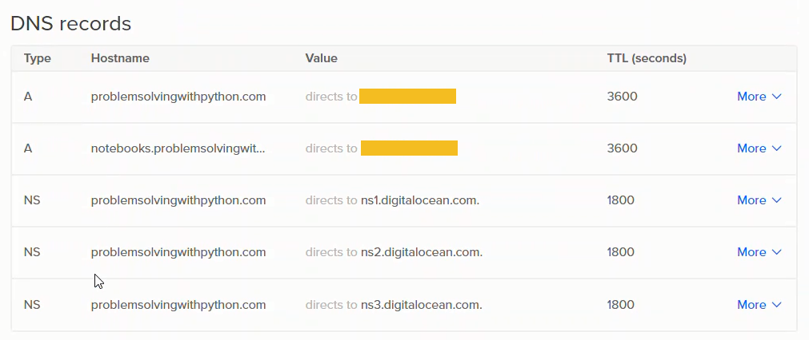

# DNS Routing

After we verify JupyterHub is working with all the default settings, we need to link a domain name our Digital Ocean server. That way students can visit a domain like engr114.org instead of having to visit an IP address like 215.154.998.607.

[TOC]

## Link domain name to server IP address

When we started JupyterHub in the previous step, it ran, we could log in, and we could run Python code. What's not to like, right? **Well, security is the big problem.** 

!!! warning
    <strong>Do not run JupyterHub in production without SSL security.</strong>

In the initial setup, JupyterHub was running under regular http, not https. With a web application that has usernames and passwords, like JupyterHub, having https and SSL security is best (or really manditory). 

In order to use https, we need to generate an SSL certificate. The SSL certificate should correspond to the domain name linked to our server. Therefore, the first step on our way to SSL security, is purchasing a domain name and pointing the domain name at the Digital Ocean DNS servers. Then we'll link the domain name to our JupyterHub server.

## Google Domains

I purchased the domain for this JupyterHub deployment from [Google Domains](https://domains.google.com). The domain cost $12/year (which seems pretty reasonable) and Google domains makes set up pretty easy. 

After purchasing the domain, I added the Digital Ocean DNS servers as a set of custom name servers to my domain options on Google Domains.


To add a set of custom name servers using the Google Domains dashboard, click the button with the two bars under the DNS header. This brings up a page where you can enter in the Digital Ocean DNS server addressess. 

The name servers to add are:

```text
ns1.digitalocean.com
ns2.digitalocean.com
ns3.digitalocean.com
```



Make sure to click the radio button [Use custom name servers] and click [Save].

## Digital Ocean DNS

Now we are going to set our domain to link to the IP address of our server on Digital Ocean. 

Log into Digital Ocean and in the upper right select [Create] --> [Domains/DNS]



In the [Add a domain] field, type in the domain name without http, but including .com (or .edu/.org/.net)  such as ```mydomain.org```, then click [Add Domain].


This brings up a panel where we can add a DNS record. I want the JupyterHub server to have the web address of the domain I purchased, no subdomains like notebooks.mydomain.com for this installation of JupyterHub. 

I entered ```@``` in the text field labeled [Enter @ or hostname]. Then selected the Droplet (our JupyterHub server) that the web address will route to.



I also entered ```www``` in the text field [Enter @ or hostname], then selected the JupyterHub droplet like before. This way ```www.mydomain.org``` will route to our JupyterHub server as well.
 
 After completing this step, there will be a couple of new DNS records on the Digital Ocean dashboard. The results will look something like the screen capture below:
 


It takes a couple minutes for the DNS switchover to complete. [https://www.whatsmydns.net](https://www.whatsmydns.net) can be used to check the NS and A records of your domain and see if the domain name is getting through. 

The first time I set up DNS on Digital Ocean, I added the custom DNS servers to Google Domains but neglected to select the [use custom name servers] radio button on the Google Domains dashboard. It looked like the domain was routing to Digital Ocean, but actually the domain was just staying with Google. Once I clicked the [use custom name servers] radio button and waited a couple minutes, the change over happened. It did take a bit of time though; not hours, but more than a few minutes.

## Next Steps

The next step is to obtain an SSL certificate so we can add SSL security and use https instead of http.

<br>
