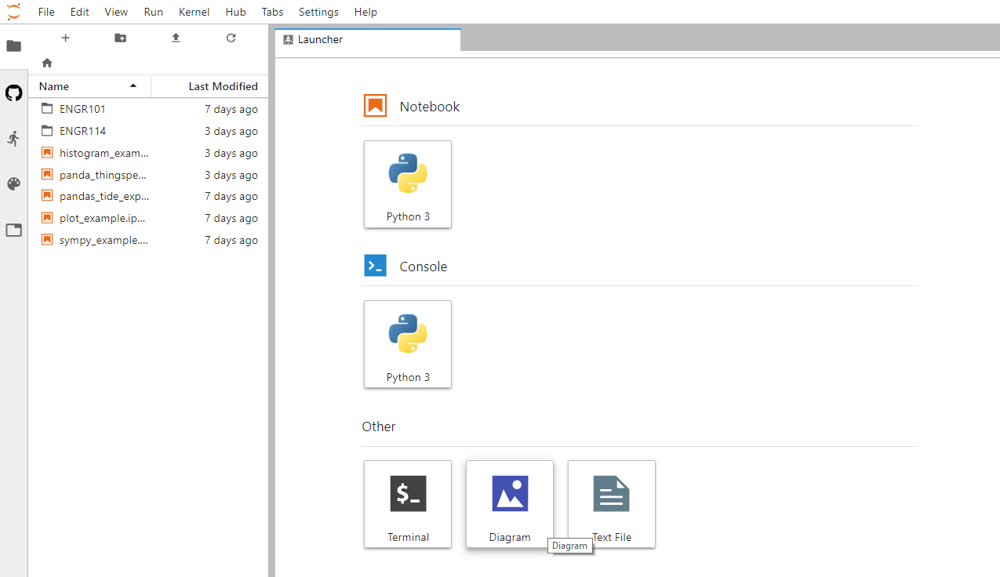
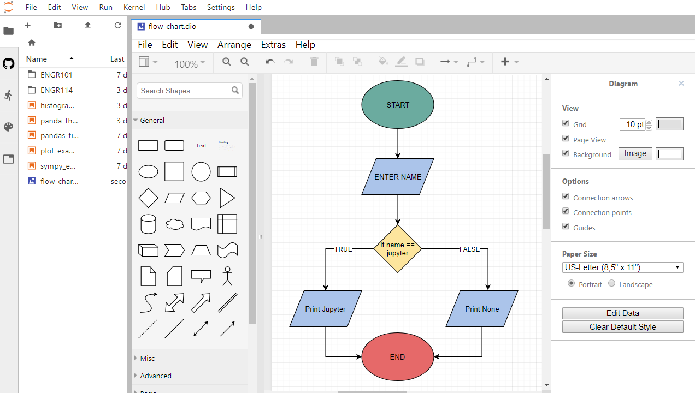

# Draw.IO Extension

In ENGR114, students will learn how to construct flow charts that describe the way a program runs. They will also use flowcharts to plan how a program will run. We can provide students with access to a flow chart drawing program right in JupyterHub called Draw.IO. Draw.IO will be added to our JuptyerHub deployment as a JupyterLab extension.

[TOC]

## Install nodejs

Ensure that nodejs is intalled in the ```(jupyterhubenv)``` virtual environment. Nodejs is needed to install the Draw.IO JupyterLab extension.

```
$ sudo systemctl stop jupyterhub
$ conda activate jupyterhubenv
(jupyterhubenv)$ conda install -c conda-forge nodejs
```

## Install Draw.IO extension for JupyterLub

Another conda install line to install the Draw.IO extension for 
JupyterLab.

```
(jupyterhubenv)$ jupyter labextension install jupyterlab-drawio
```

## Restart JupyterHub and test it out

```
$ sudo systemctl start jupyterhub
$ sudo systemctl status jupyterhub
[Ctrl]-[c] to exit
```






## Summary

This page showed how to install the Draw.IO extension for JupyterLab. JupyterHub users the open the JupyterLab interface can use Draw.IO to create flow charts and other useful diagrmas.

<br>
