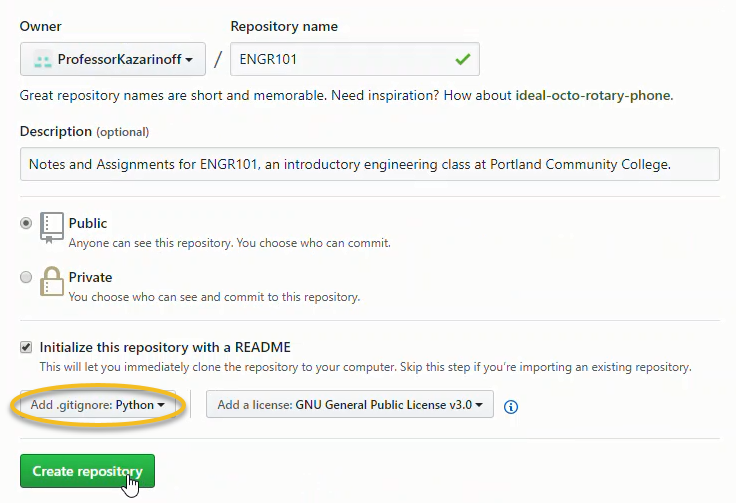

# Assignments from GitHub

Now we'll build a pre-spawn hook that creates an "assignments" and "notes" directory with pre-constructed assignments and notes for each JupyterHub user.

[TOC]

## Create a repo of assignments on github.com

On github.com, create a new repo with the notes and assignments for the quarter.




On a local computer, not the server, clone the GitHub repo. This allows us to work on the notes and assignments locally.

```
# local computer
$ mkdir ENGR101
$ cd ENGR101
$ git init
$ git remote add origin https://github.com/username/reponame.git
$ git pull origin master
```

On the local computer, not the server, build the assignment and notes for the quarter. I did this using Jupyter notebooks. Then add, commit and push the changes up to GitHub.

```
# local computer
$ git add .
$ commit -m "added assignments and notes"
$ git push origin master
```

<br>

## Install gitpython

Now we can go to the server and have the notebooks we created (and pushed up to GitHub) pre-populate each user's directory tree when they log into JupyterHub.

We'll use a Python package called **gitpython** to help with pulling the notebooks down from github.com. Log into the server and install **gitpython** using **conda**:

```
# on the server
$ sudo apt-get update
$ conda install -c conda-forge gitpython
```

Now we need to modify the ```jupyterhub_config.py``` file to do a couple things:

* Run a pre-spawn hook function that runs before each user's Jupyter notebook server is started
* Pull the assignments and notes down from GitHub as part of the pre-spawn hook function.

The pre-spawn hook function gets called every time a user logs into JupyterHub.  This pre-spawn hook will run before the user's Jupyter notebook server is created. In the pre-spawn hook, we want to check to see if the user has the assignments and notes pulled down from GitHub already loaded. If the user doesn't have the assignments, then we want to pull the assignments down from GitHub and put them in the user's directory tree.

## Git clone function

So first we need a function that will pull the repo down from GitHub. Note the line ```uid = getpwnam(user).pw_uid``` and ```gid = getpwnam(user).pw_gid``` in the function below. These lines of code get the user's numerical unix user ID and group ID. The user ID and group ID are needed to assign the proper permissions to the files we pull down from GitHub.

When I first built the function, changing file permissions was not included. I could log onto JupterHub and see the notebooks pulled down from GitHub, but I couldn't run or edit them. The problem was that the notebooks were pulled down from GitHub by a **sudo user** and the JupyterHub user didn't have the permissions to write or execute any of the files. Building the permissions into the function with ```shutil.chown()``` solved the problem.

```python
# in jupyterhub_config.py

def clone_repo(user, git_url, repo_dir):
    """
    A function to clone a github repo into a specific directory of a user.
    """
    Repo.clone_from(git_url, repo_dir)
    uid = getpwnam(user).pw_uid
    gid = getpwnam(user).pw_gid
    for root, dirs, files in os.walk(repo_dir):
        for d in dirs:
            shutil.chown(os.path.join(root, d), user=uid, group=gid)
        for f in files:
            shutil.chown(os.path.join(root, f), user=uid, group=gid)
```

## Create pre-spawn hook

Now we'll build a pre-spawn hook function that will run when the spawner starts. The function will call the ```clone_repo()``` function and pull down the assignments from the github repo the first time a user logs into JupyterHub.  After the assignments and notes are initially created, each subsequent time the user logs into JupyterHub, a new fresh set of assignments and notes are pulled down if ```ERASE_DIR``` is set to ```True```. If ```ERASE_DIR``` is set to ```False```, once the assignments and notes are downloaded, they will not be over-written.

To run the pre-spawn hook function and the pull repo function, we need to make sure the following imports are present in our jupyterhub_config.py file:

```python
# /etc/jupyterhub/jupyterhub_config.py

import git, os, shutil
from pwd import getpwnam
```

The complete pre-spawn hook function is below:

```python
# /etc/jupyterhub/jupyterhub_config.py

...

def create_dir_hook(spawner):
    """
    A function to clone a github repo into a specific directory of a 
   JupyterHub user when the server spawns a new notebook instance.
    """
    username = spawner.user.name
    DIR_NAME = os.path.join("/home", username)
    git_url = "https://github.com/ProfessorKazarinoff/ENGR101.git"
    repo_dir = os.path.join(DIR_NAME, 'notebooks')

    if ERASE_DIR == True:
        if os.path.isdir(repo_dir):
            shutil.rmtree(repo_dir)
        os.mkdir(repo_dir)
        clone_repo(username, git_url, repo_dir)

    if ERASE_DIR == False and not (os.path.isdir(repo_dir)):
        os.mkdir(repo_dir)
        clone_repo(username, git_url, repo_dir)

    if ERASE_DIR == False and os.path.isdir(repo_dir):
        pass

...

```

The two functions need to be pasted into the ```jupyterhub_config.py file```. Make sure the imports are present as well as an ```ERASE_DIR = True``` or ```ERASE_DIR = False``` line in the ```jupyterhub_config.py``` file too.

## Add pre-spawn hook to jupyterhub_config.py

Next we need to add a pre-spawn hook function to the spawner object in our ```jupyterhub_config.py``` file in the form of:

```python
# /etc/jupyterhub/jupyterhub_config.py
...

c.Spawner.pre_spawn_hook = create_dir_hook

...

```

## Restart JupyterHub

With these changes complete, we can restart JupyterHub the commands:

```
$ sudo systemctl stop jupyterhub
$ sudo systemctl start jupyterhub
$ sudo systemctl status jupyterhub
```

To exit the status screen, use [Ctrl] + [c].

<br>