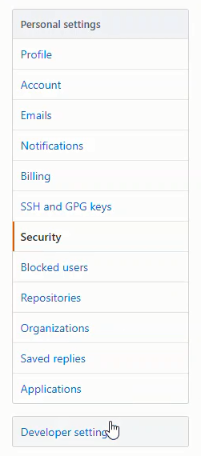
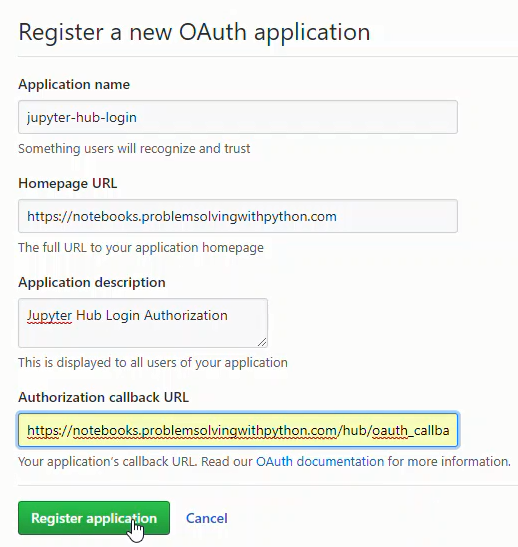
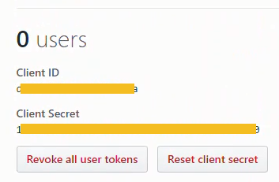

# GitHub Authentication

JuptyerHub is working, but a problem is that we have to add new users(students) to the serever manually. It would be better if users could log in to JupyterHub with their own usernames and passwords. It would also be nice to not have to manage any of these usernames or passwords. 

One solution to this problem is have students log into JupyterHub with GitHub usernames and passwords.

[TOC]

In the current setup, users (students) have to be added to the JupyterHub server before they can log in. This is OK for a small team or a couple users, but for a college class, creating a new user on the server for each student, then emailing each student a seperate username and password... 

Ah! what a mess. 

One solution is to give JupyterHub the authority to create new users on the server.  Then allow users (students) to login to JupyterHub with usernames and passwords they already have.

One of the ways students could log into JupyterHub is using their GitHub credentials. This solution requires each student to have a GitHub account. A GitHub account for each student might be worth it. A benefit is a GitHub account gives students exposure to **git** and GitHub as a tools. 

So let's give the GitHub authenticator for JupyterHub  a whirl. The GitHub authenticator is also pretty well documented, so it's good authenticator to try first.

## Install oauthenticator

To use the GitHub authenticator in JupyterHub, first we need to install **oauthenticator**. I couldn't find oauthenticator on conda-forge so I installed it with **pip**. Remember we need to be in the ```(jupyterhubenv)``` virtual environment when we run the ```pip``` command.

```text
$ conda activate jupyterhubenv
(jupyterhubenv)$ pip install oauthenticator
```

## Create GitHub OAuth App

Next we need to log into GitHub and create an OAuth App. After the GitHub OAuth App is created, copy the **Client ID** and **Client Secret**. The processes is:

GitHub profile --> Settings --> Developer Settings --> OAuth Apps --> Register a new application





Set the **Homepage URL** as:

    https://mydomain.org/

Set the **Authorization call-back URL** as:

    https://mydomain.org/hub/oauth_callback

Then click [Register Application]



In the App Settings page, we need to copy two settings:

 * Client ID
 * Client Secret


 
The **Client ID** and **Client Secret** strings will be pasted into the jupyterhub_config.py file. 

<br>

## Modify jupyterhub_config.py to use GitHub OAuth

Now we'll edit the ```jupyterhub_config.py``` file to include a couple additional lines. 

Note in the configuration below, ```#c.Authenticator.whitelist``` is commented out. We want to see if a GitHub user can log onto the server (which will automatically create a new user and spawn a Jupyter notebook server) and run notebooks. Once we know the server is working, we can un-comment the ```#c.Authenticator.whitelist``` and only allow in specific GitHub usernames. Also Note ```c.LocalGitHubOAuthenticator.client_id = 'xxxx'``` and ```c.LocalGitHubOAuthenticator.client_secret='xxxx'``` are the long strings from our GitHub OAuth App.

```python
# /etc/jupyterhub/jupyterhub_conf.py

# Configuration file for JupyterHub to run GitHub OAuth.
# Need to get client ID and client secret from GitHub --> User Settings --> Developer Settings --> OAuth Apps
# also need to pip install oauthenticator

from oauthenticator.github import LocalGitHubOAuthenticator
c.JupyterHub.authenticator_class = LocalGitHubOAuthenticator

# Set up config
c = get_config()
c.JupyterHub.log_level = 10
c.Spawner.cmd = '/opt/miniconda3/envs/jupyterhubenv/bin/jupyterhub-singleuser'

# Cookie Secret Files
c.JupyterHub.cookie_secret_file = '/srv/jupyterhub/jupyterhub_cookie_secret'
c.ConfigurableHTTPProxy.auth_token = '/srv/jupyterhub/proxy_auth_token'

# GitHub OAuth Login
c.LocalGitHubOAuthenticator.oauth_callback_url = 'https://mydomain.org/hub/oauth_callback'
c.LocalGitHubOAuthenticator.client_id = 'XXXXXXXXXXXXXXXXXXXXXXXXXXXXX'
c.LocalGitHubOAuthenticator.client_secret = 'XXXXXXXXXXXXXXXXXXXXXXXXXXXXXXXXXXXXX'
c.LocalGitHubOAuthenticator.create_system_users = True

#c.Authenticator.whitelist = {'peter','username1','username2'}
c.Authenticator.admin_users = {'peter'}
```

## Restart JupyterHub and login with GitHub

Restart JupyterHub with:

```text
$ sudo systemctl stop jupyterhub
$ sudo systemctl start jupyterhub
$ sudo systemctl status jupyterhub
# [Ctrl]-[c] to exit
```

Browse over to our server's URL. We see [Sign in with GitHub] in the middle of the page. Log into JupyterHub with a GitHub username and password. 


After we log in using a GitHub username and password, we can see if JupyterHub created a new user (with our GitHub username) on the server. The command below produces a long list of users. The long list of users contains the non-root sudo user ```peter``` and the GitHub user.

```text
$ awk -F':' '{ print $1}' /etc/passwd

....
uuidd
dnsmasq
landscape
sshd
pollinate
peter
githubusername
```

We can also verify the GitHub user logged in by going to the ```/home/``` directory on the server. Inside of ```/home/``` should be a home directory for the GitHub user. Inside the GitHub user's directory are any notebooks we just created after we logged in with our GitHub credentials.

```text
$ cd /home
$ ls
peter  githubusername
$ cd githubusername
$ ls
Untitled.ipynb 
```

## Summary

This page documented how to use GitHub usernames and passwords to authenticate with JupyterHub. 

<br>
