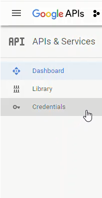
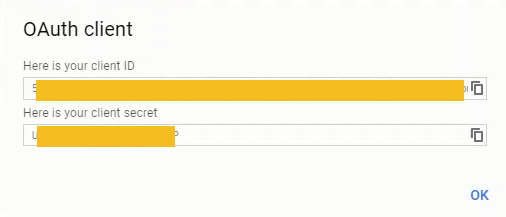

# Google Authentication

Now that we have JupyterHub running as a system service and we can log onto JupyterHub with the local PAM (regular linux usernames and passwords) authenticator, we are going to get into the weeds of getting the Google authenticator to work. 

Why Google authenticator instead of local PAM authentication? Our college uses the Gmail suite for both staff and students. When students log onto their college email, they are logging into Gmail. Students can use Google Calendar and Google Drive with their college email account as well. So it is probably best that students log into JuypterHub using the same Google login they use to access their college email, Google Drive and Calendar. 

[TOC]

## Google OAuth Instance

To allow students to use Google usernames and passwords to log into JupyterHub, the first thing we need to do is set up a Google OAuth instance. I set up Google OAuth instance using my personal Gmail account, rather than my college Gmail account. Some parts of the Google Apps Suite are not available in my college profile, like YouTube and developer tabs. 

To obtain the Google OAuth credentials, we need to log into the Google API console [https://console.developers.google.com/](https://console.developers.google.com/) and select [Credentials] on the lefthand menu.



Next we'll create a new OAuth credential under [Credentials] --> [Create Credentials] --> [OAuth client ID]:


To create a set of Google OAuth credentials we need to input:

 * Authorized JavaScript origins: ```https://mydomain.org```
 * Authorized redirect URIs: ```https://mydomain.org/hub/oauth_callback```


After creating a new set of Google OAuth credentials, note the:

 * client ID
 * client secret
 

 
 The client ID and client secret strings will be included in our revised JupyterHub configuration.

 This deployment, I also downloaded a .json file which contains the Client ID and Client secret strings from the Google Developer Console. We'll upload the .json file to our JupyterHub server and use Python's **json** module to read file. 

The .json file from the Google Developer console has the following format:

```text
{
    "web": {
        "client_id": "XXXXXXXXXXXXXXXXXXXXXXXXXXXX.apps.googleusercontent.com",
        "project_id": "intense-agency-89620",
        "auth_uri": "https://accounts.google.com/o/oauth2/auth",
        "token_uri": "https://oauth2.googleapis.com/token",
        "auth_provider_x509_cert_url": "https://www.googleapis.com/oauth2/v1/certs",
        "client_secret": "XXXXXXXXXXXXXXXXXXXXXXXXXXXXXX",
        "redirect_uris": [
            "https://mydomain.org/hub/oauth_callback"
        ]
    }
}
```

!!! warning
    Add any files with secret credentials like google_outh_credentials.json to the .gitignore file under source control. **Keep private credentials private**

We can use Python's json module to pull out the ```"client_id"``` string, the ```"client_secret"``` string and the ```"redirect_uris"``` string.

The general format for loading a json file into a Python dictionary is below:

```python
with open('/etc/jupyterhub/google_oauth_credentials.json') as f:
    google_oauth = json.load(f)
```

Then we can use the ```google_oauth``` dictionary and access the data within it using regular Python dictionary access methods. The syntax is below:

```python
c.LocalGoogleOAuthenticator.client_id = google_oauth['web']['client_id']
```

Let's also build a ```college_id.json``` file that contains our college domain and college name. We can pull these strings out with Python's json module too. 

The ```college_id.json``` file has the format below:

```text
{
    "domain": "mycollege.edu",
    "name": "My College Name"
}

```

We can pull out the ```"domain"``` and ```"name"``` from ```college_id.json``` with the following Python code:

```python
with open('/etc/jupyterhub/college_id.json') as f:
    college_id = json.load(f)
c.LocalGoogleOAuthenticator.hosted_domain = college_id['domain']
c.LocalGoogleOAuthenticator.login_service = college_id['name']
```

Before we can use the ```google_oauth_credentials.json``` and ```college_id.json``` in our JupyterHub configuration, we need to upload these files to the server. I moved the files over with FileZilla.

After the files are moved over, you should be able to see a couple files in the ```/etc/jupyterhub``` directory on the server.

```text
$ cd /etc/jupyterhub
$ ls
college_id.json                jupyterhub.sqlite
google_oauth_credentials.json  jupyterhub_config.py
```


## Install the OAuthenticator package on the server

Before our JupyterHub server can Google authentication, we first need to install the OAuthenticator Python package on the server.

```text
$ sudo apt-get update
$ sudo apt-get upgrade
$ conda activate jupyterhubenv
(jupyterhubenv)$ pip install oauthenticator
```


## Modify jupyterhub_config.py

Once we get our Google OAuth credentials uploaded onto the server, and we have installed the oauthenticator package, we need to edit ```jupyterhub_conf.py``` again. Note how the ```google_oauth_credentials.json``` and ```college_id.json``` files are used in the configuration. 

```python
# /etc/jupyterhub/jupyterhub_conf.py

import json

# For Google OAuth
from oauthenticator.google import GoogleOAuthenticator


# Set up config
c = get_config()
c.JupyterHub.log_level = 10

# Cookie Secret and Proxy Auth Token Files
c.JupyterHub.cookie_secret_file = '/srv/jupyterhub/jupyterhub_cookie_secret'
c.ConfigurableHTTPProxy.auth_token = '/srv/jupyterhub/proxy_auth_token'

# Bring in Google OAuth client ID and client secret from json file
with open('/etc/jupyterhub/google_oauth_credentials.json') as f:
    google_oauth = json.load(f)

# Google OAuth Login
c.JupyterHub.authenticator_class = GoogleOAuthenticator
c.LocalGoogleOAuthenticator.oauth_callback_url = google_oauth['web']['redirect_uris'][0]

c.LocalGoogleOAuthenticator.client_id = google_oauth['web']['client_id']
c.LocalGoogleOAuthenticator.client_secret = google_oauth['web']['client_secret']

c.LocalGoogleOAuthenticator.create_system_users = True
c.Authenticator.add_user_cmd = ['adduser', '-q', '--gecos', '""', '--disabled-password', '--force-badname']

# College Specific Names
with open('/etc/jupyterhub/college_id.json') as f:
    college_id = json.load(f)
c.LocalGoogleOAuthenticator.hosted_domain = [college_id['domain']]
c.LocalGoogleOAuthenticator.login_service = college_id['name']

c.Authenticator.whitelist = {'peter','peter.kazarinoff'}
c.Authenticator.admin_users = {'peter','peter.kazarinoff'}

``` 

This little line:

```python
c.Authenticator.add_user_cmd = ['adduser', '-q', '--gecos', '""', '--disabled-password', '--force-badname']
```

was a real gottacha. Our college email addresses are in the form:

```firstname.lastname@college.edu```

When a student logs in, JupyterHub tries to create a new Linux user with a dot ```.``` in their username. Usernames with ```.``` doesn't work on Linux. I tried to create a new Linux user with a dot in their username, and the terminal asked me to use the ```--force-badname``` flag. So ```--force-badname``` is what we'll add to the ```c.Authenticator.add_user_cmd``` list. Otherwise, users (students) will be able to authenticate with Google, but they won't get a new user account on the server, and they won't be able to run notebooks or Python code.

## Restart JupyterHub and Login

Restart JupyterHub and browse to the web address attached to the server.

```
$ sudo systemctl stop jupyterhub
$ sudo systemctl start jupyterhub
$ sudo systemctl status jupyterhub
# [Ctrl + c] to exit
```

The login window should now look something like:


We can log in with our Google user name and password (college username and password). 

Pretty sweet!

After we log in using our college username and password, we can see if JupyterHub created a new user (with our college username) on the server. The command below produces a long list of users. This long list contains the non-root sudo user ```peter``` and the Google authenticated user (college username).

```text
$ awk -F':' '{ print $1}' /etc/passwd
....
uuidd
dnsmasq
landscape
sshd
pollinate
peter
peter.lastname
```

<br>

## Next Steps

The next step is to use the JupyterLab interface as the default interface. This means when students log into JupyterHub, they see JupyterLab instead of the typical Jupyter notebook file browser.

<br>
