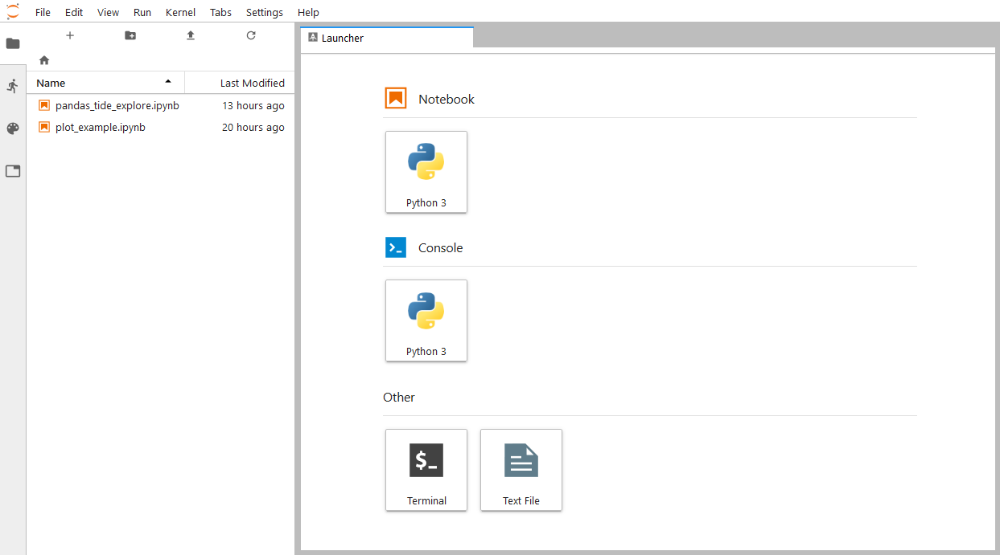
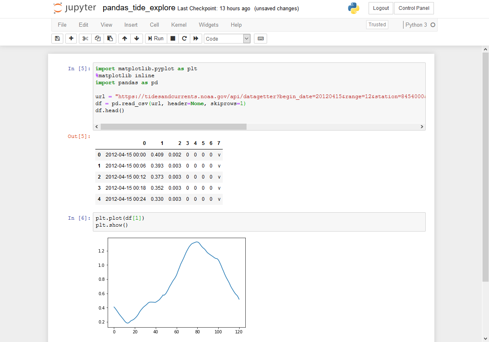
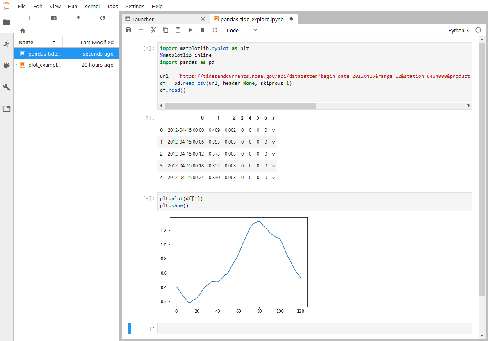
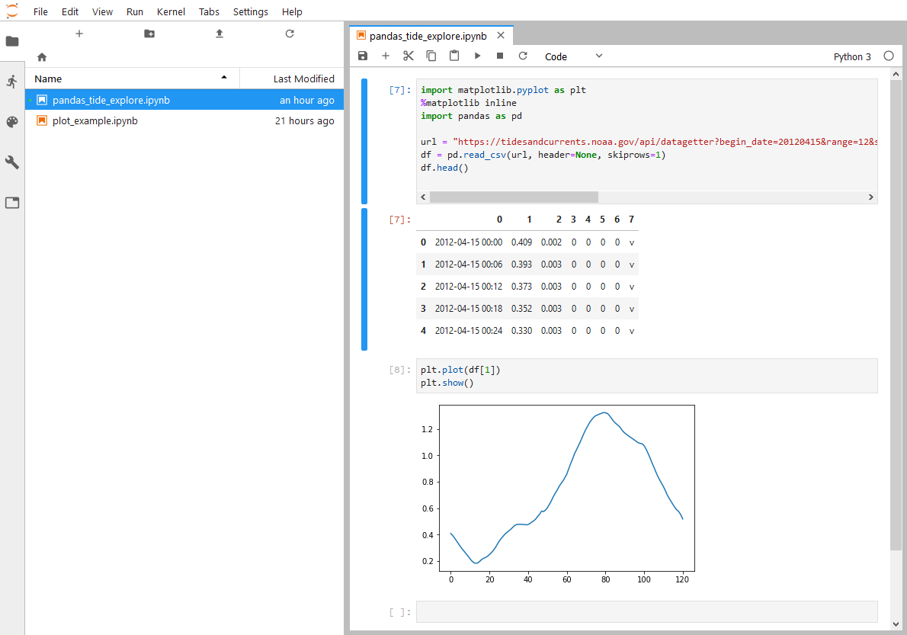
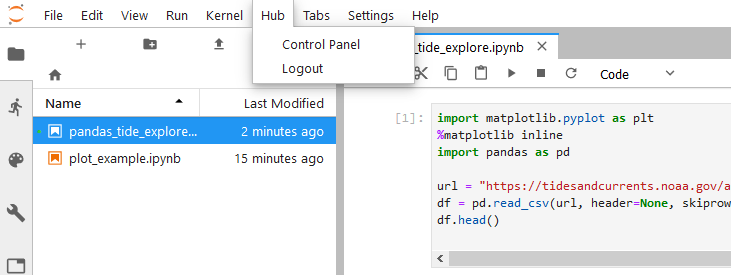
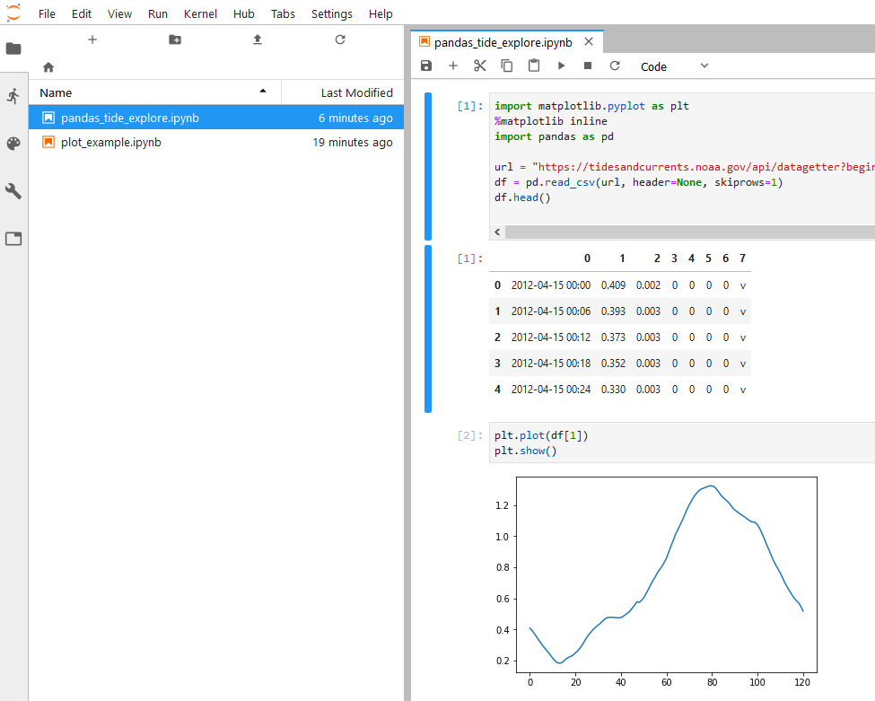

# JupyterLab Default Interface

Over the summer, when I ran JupterHub for the first time, we used the regular Jupyter notebook interface. For this deployment, I want to prototype using the JupyterLab interface. 

Below is the file browser in the regular Jupyter notebook interface. This is what students see now when they log into JupyterHub.


But students could also be greeted by the **JupyterLab** interface after they log in. Luckily, the JupyterLab interface is built right into JupyterHub. We can access the JupyterLab interface by logging into JupyerHub and modifying the URL.

Below is the URL when you are logged into the notebook file browser:

```
https://mydomain.org/user/user.name/tree
```

In the URL, if we remove ```/tree``` and replace it with ```/lab``` the result is the JupyterLab interface.

```
https://mydomain.org/user/user.name/lab
```

The resulting JupyterLab interface is shown below:



<br>

We can get back to the regular notebook interface by replacing ```/lab``` with ```/tree```.

<br>

The regular Jupyter notebook interface, running a notebook, is shown below:




If we switch to the JupyterLab interface, the same notebook looks like this:



## Modify jupyterhub_config.y

To use JupyterLab as the default landing page (instead of the regular notebook interface), add a line to ```jupyterhub_config.py``` in the ```/etc/jupyterhub/``` directory

```python
# /etc/jupyterhub/jupyterhub_config.py

...

# Start Users at the JupyterLab Interface
c.Spawner.default_url = '/lab'

...
```

That's it. It's that easy to switch between the regular notebook and JupyterLab interfaces.


## Restart JupyterHub

After ```jupyterhub_config.py``` is saved, let's restart JupyterHub and see the results.

```text
$ sudo systemctl stop jupyterhub
$ sudo systemctl start jupyterhub
$ sudo systemctl status jupyterhub
# ctrl-c to exit the status pannel
```

When we log into JupyterHub, we are greated by the JupyterLab interface:



## Install JupyterLab extension for JupyterHub

Once advantage of the good old classic notebook interface is it contains buttons to login and logout of Jupyter Hub, and buttons to start and stop our server. Login/logout and server start/stop controls are absent from the JupyterLab interface. Luckily, these controls can be added into JupyterLab with the [JupyterHub extension for JupyterLab](https://github.com/jupyterhub/jupyterlab-hub)

To install the JupyterLab extension for JupyterHub, log 
into the server, then activate the ```(jupyterhubenv)``` virtual environment. The extenion is installed with the command below:

```text
$ conda activate jupyterhubenv
(jupyterhubenv)$ jupyter labextension install @jupyterlab/hub-extension
```

I had to run this command twice to get the extension to install. Don't know why. The first time I ran the command, I was greeted by an error about installing or using yarn. But when I ran it a second time, it worked.

To use JupyterLab extension, add a line to ```jupyterhub_config.py``` in the ```/etc/jupyterhub/``` directory:

```python
# /etc/jupyterhub/jupyterhub_config.py

...

# Use the JupyterLab extension for JupyterHub.
# install with $ jupyter labextension install @jupyterlab/hub-extension
c.Spawner.cmd = ['jupyter-labhub']

...

```

## Restart JupyterHub

After ```jupyterhub_config.py``` is saved, restart JupyterHub and see the results.

```
$ sudo systemctl stop jupyterhub
$ sudo systemctl start jupyterhub
$ sudo systemctl status jupyterhub
# [ctrl]-[c] to exit the status pannel
```

When we log into JupyterHub, we see the JupyterLab interface with a new [Hub] menu along the top:



If you select [Control Pannel], you end up with same buttons contained in the Jupyter notebook interface. 

If we [Stop My Server], then re-[Start My Server], we end up back in the JupyterLab interface.




## Next Steps

The next step to build a custom login page. When students visit our domain, instead of seeing the regular JupyterHub login page, they see a custom login page that looks a lot like our college login page. This custom login page will look familiar to students.

<br>
