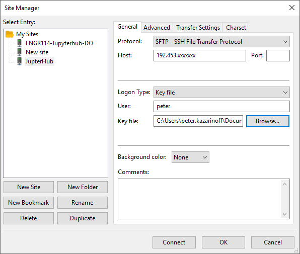

# Custom Login Page

The JupyterHub login page looks like this:


But our college login page looks like this:


For users to feel comfortable with logging into the JupyterHub server, we'll make the JupyterHub login page look more like the college login page.

[TOC]

## Create a templates directory and populate it with Jinja templates

This was a time consuming and fussy task. It involved a lot of messing around with css and html.

First, a set of custom **jinja** templates need to be created. When JupyterHub runs, there is a directory of jinja templates that build the html users see when they browse to the login page. These jinga templates are burried deep in the JupyterHub package code. For my JupyterHub installation on the server, I found the jinja template files in the ```/opt/miniconda3/envs/jupyterhubenv/share/jupyterhub/templates/``` directory. If you aren't using a virtual environment, the JupyterHub package directory name will likey be different:

```text
/opt/anaconda3/envs/pkgs/jupyterhub/share/jupyterhub/templates/
├── 404.html
├── admin.html
├── error.html
├── home.html
├── login.html
├── logout.html
├── page.html
├── spawn.html
├── spawn_pending.html
└── token.html
```

Now we need to copy these templates into a new ```/etc/jupyterhub/templates``` directory. Once copied, we can modify the templates and create a new JupyterHub login page. ```login.html``` is the file we'll customize.

```text
$ cd /opt/miniconda3/envs/jupyterhubenv/share/jupyterhub
$ ls
static  templates
$ cp -R templates /etc/jupyterhub/templates/
$ cd /etc/jupyterhub/templates
$ ls
404.html    error.html  login.html   oauth.html  spawn.html          stop_pending.html
admin.html  home.html   logout.html  page.html   spawn_pending.html  token.html
```

## Modify login.html

Open up the ```login.html``` file and modify it with any html that you want to show up when a user goes to the JupyterHub site. This is what the user will see first thing, before they have logged in.

I messed around for WAY to long trying to get my custom login page to look like the college login page. An important piece of html that needs to stay in the ```login.html``` file is the ```<a>``` tag that links to the authentication url. The complete tag is detailed below:

```html
<!–– login.html ––>

<a role="button" class="btn btn-jupyter btn-lg" href="/hub/oauth_login?next=">
    Sign in with Portland Community College
</a>
```

I also kept in the jinga tag at the top of the file that brings in all of the formatting from login.html's parent template page.html

```html
<!–– login.html ––>


```

All the changes I made to the login template were inside the "login" block of ```login.html```. 

```html


<!–– make changes here ––>


```

You can find my complete ```login.html``` file on GitHub [here](https://github.com/ProfessorKazarinoff/jupyterhub-engr114/blob/master/templates/login.html). 

I used the FileZilla SFTP Windows App to move over the ```login.html```. To use FileZilla, Select [File] --> [Site Manager]. Select [SFTP], add the server IP address, username, and select [Log in Type] --> [Key File]. FileZilla settings are below:



## Modify jupyterhub_config.py

Now we need to modify the ```jupyterhub_config.py``` file so that our new set of custom jinja templates are used instead of the default jinja templates.

A problem I initially had was I set the directory path of the custom templates as ```templates``` and the login page didn't work as expected. When I changed the directory path to ```templates/``` the problem was resolved.

```python
# /etc/jupyterhub/jupyterhub_config.py

...

# sets a custom html template at the login screen.
c.JupyterHub.template_paths = ['/etc/jupyterhub/templates/']

...

```

## Restart JupyterHub and view changes

With changes to the ```login.html``` file complete and the ```template_paths=``` set in ```jupyterhub_config.py```, we can restart JupyterHub and view the changes rendered on the login page.

```text
$ sudo systemctl stop jupyterhub
$ sudo systemctl start jupyterhub
$ sudo systemctl status jupyterhub
# [Ctrl]-[c] to exit
```

The new login page is below:


The login works, but the issue is that without an css, the page looks plain and doesn't really look like the college login page:


Therefore, we need to add some css styling to the page.

<br>

## Style the login page with css

Finally, the ```style.min.css``` file needs to be modified so that the login page styling looks a little more like the college login page.

This is another thing I messed around with for a long time, a WAY to long time. I couldn't figure out a way to get JupyterHub to use a custom .css file. I tried creating a .css file in the new custom templates directory, but JupyterHub wouldn't copy it as a static asset when the server launched. I also tried putting a separate .css file deep inside of the JupyterHub package code. When the server ran, it seemed to copy the custom .css file (I could see the custom .css file using chrome's inspect element tool). But for some reason the custom .css file would be blank when server serve was running, even though the custom .css file contained a whole bunch of css code when viewed deep in the JupyterHub package code.

The solution I finally got to work was modifying the ```style.min.css``` file itself that JupyterHub uses. This file is buried deep in the JupyterHub package code:

```
/opt/miniconda3/envs/jupyterhubenv/share/jupyterhub/static/css
├── style.min.css
└── style.min.css.map
```

Modify the ```style.min.css``` file to include all the custom css styling desired (find my complete css file on GitHub [here](https://github.com/ProfessorKazarinoff/jupyterhub-engr114/blob/master/style.min.css)) 

I used FileZilla again to move over the file. ```style.min.css``` is a pretty big file and copying and pasting into PuTTY would probably lead to a lot of errors.

## Restart JupyterHub

With changes to the ```login.html``` file and ```style.min.css``` file complete, we can restart JupyterHub and view the changes rendered on the login page.

```text
$ sudo systemctl stop jupyterhub
$ sudo systemctl start jupyterhub
$ sudo systemctl status jupyterhub
# [Ctrl]-[c] to exit
```

Below is the look of the modified login page in all it's custom html and css glory:


## Next Steps

The next step is to create a set of notes and assignments in a GitHub repo. Then have JupyterHub pull down this GitHub repo for each student when the log in. This means the notes and assignments for the course are pre-populated in each student's JupyterLab file tree each time they start JupyterHub.

<br>
