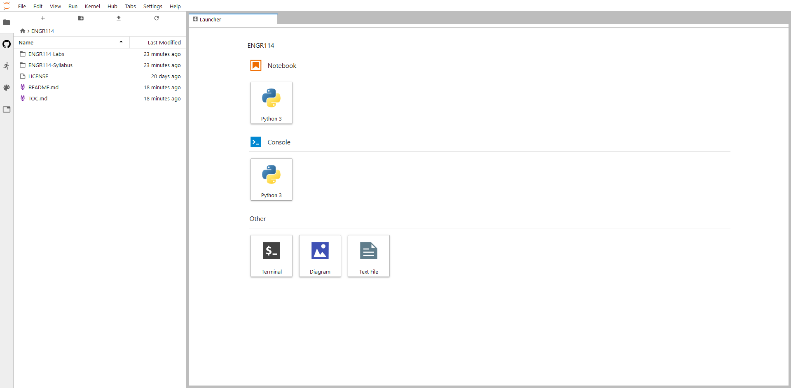

# nbgitpuller default URL

In this section, we will configure the nbgitpuller URL from the previous section into the default URL for our JupyterHub site. This mean that any time a student goes to [mydomain.org](#) --> [mydomain.org/mycustomgitpullerurl](#) 

The [nbgitpuller plugin](https://github.com/jupyterhub/nbgitpuller#constructing-the-nbgitpuller-url) pulls down a GitHub repo into each student's JupyterHub environment when students start JupyterHub by clicking on a specific link. 

When users go to a custom link such as: ```https://mydomain.org/hub/user-redirect/git-pull?repo=GitHubUserName%2FRepoName&branch=master&app=lab``` users end up pulling all the files from the specified GitHub Repo into they JupyterHub folders. They see something like the following in their browser.

 

 If we open one of the notebooks within JupyterHub, we see the same notebook that is stored on GitHub.

## Add the custom link to ```jupyterhub_config.py```

We can add this the nbgitpuller custom link to the ```jupyterhub_config.py``` file. We did this before for when we made [JupyterLab the default environment](jupyterlab_default.md). 

Log into the server and shut down Jupyterhub.

```text
$ sudo systemctl stop jupyterhub
```

```cd``` to the ```/etc/jupyterhub/``` directory and open up the ```jupyterhub_config.py``` file

```text
$ cd /etc/jupyterhub
$ ls
jupyterhub.sqlite  jupyterhub_config.py  jupyterhub_cookie_secret  templates
$ nano jupyterhub_config.py
```

Inside the jupyterhub_config.py file, modify the line ```c.Spawner.default_url = '/lab'``` to instead point to the custom nbgitpuller URL. You can build a cusom nbgitpuller URL using this app: 

 > [https://mybinder.org/v2/gh/jupyterhub/nbgitpuller/master?urlpath=apps/binder%2Flink_generator.ipynb](https://mybinder.org/v2/gh/jupyterhub/nbgitpuller/master?urlpath=apps/binder%2Flink_generator.ipynb)


This produces a URL that is of the form: ```https://engr114.org/hub/user-redirect/git-pull?repo=ProfessorKazarinoff%2FENGR114&branch=master&app=lab```. We only need part of this for the ```default_url```. We'll keep everything after the ```https://engr114.org```

```
/hub/user-redirect/git-pull?repo=ProfessorKazarinoff%2FENGR114&branch=master&app=lab
```

## Modify ```jupyterhub_conf.py``` !!! Still does not work !!!.

In ```jupyterhub_config.py``` modify the file to include:

```text
# /etc/jupyterhub/jupyterhub_config.py

...

# Start Users at a default nbgitpuller url.
# Users pull down from the GitHub repo for the class automatically.
c.Spawner.default_url = '/user-redirect/git-pull?repo=ProfessorKazarinoff%2FENGR114&branch=master&app=lab'

...

Save the changes and restart JupyterHub.

```text


## Summary

In this section we installed the nbgitpuller plugin for JupyterHub. Then we created a custom URL. When we browse to the custom URL, we enter our JupyterHub environment with all the files contained on GitHub placed in our user directory. 

This is a great plugin to have with JupyterHub. Now when we make changes to the Labs or Assignments in the GitHub Repo, those changes are reflected when students log into JupyterHub with the special URL.

## Next Steps

Next, we'll configure JupyterHub to automatically go the the URL we setup with the nbgitpuller plugin. So when students go to ```domain.org``` they get the same files as if they went to the custom plugin URL ```https://mydomain.org/hub/user-redirect/git-pull?repo=GitHubUserName%2FRepoName&branch=master&app=lab```

