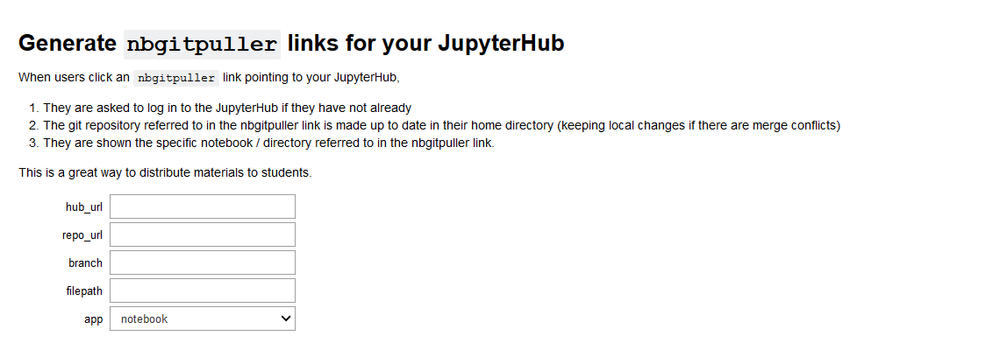
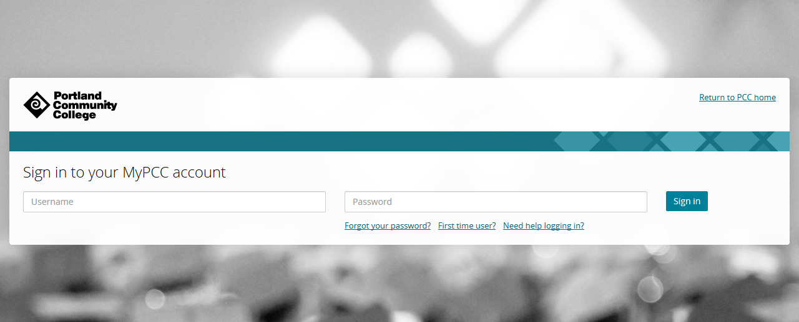
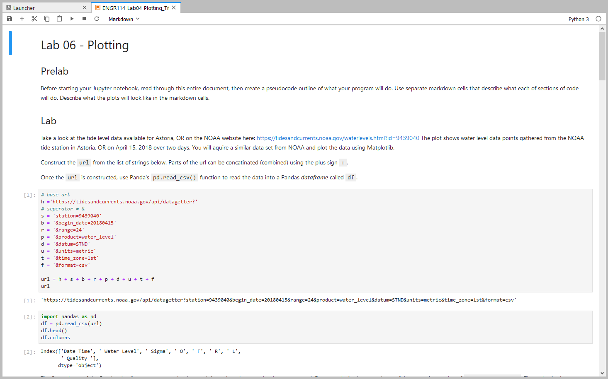

# nbgitpuller Plugin

In this section, we will install, enable and test the [nbgitpuller plugin](https://github.com/jupyterhub/nbgitpuller#constructing-the-nbgitpuller-url).

[TOC]

## Introduction

The [nbgitpuller plugin](https://github.com/jupyterhub/nbgitpuller#constructing-the-nbgitpuller-url) pulls down a GitHub repo into each student's JupyterHub environment when students start JupyterHub by clicking on a specific link. 

The repo for the nbgitpuller plugin is here:

 > [https://github.com/jupyterhub/nbgitpuller#constructing-the-nbgitpuller-url](https://github.com/jupyterhub/nbgitpuller#constructing-the-nbgitpuller-url)

The URL for the auto-generated URL contruction app in Binder is here:

 > [https://mybinder.org/v2/gh/jupyterhub/nbgitpuller/master?urlpath=apps/binder%2Flink_generator.ipynb](https://mybinder.org/v2/gh/jupyterhub/nbgitpuller/master?urlpath=apps/binder%2Flink_generator.ipynb)

## Install the nbgitpuller plugin

To install the nbgitpuller plugin for JupyterHub, first log into the server and stop JupyterHub. Then activate the ```(jupyterhubenv)``` virtual environment and pip install the plugin. 

```text
$ sudo systemctl stop jupyterhub
$ conda activate jupyterhubenv
(jupyterhubenv)$ pip install nbgitpuller
```

After the plugin is installed, it needs to be enabled.

```text
(jupyterhubenv)$ jupyter serverextension enable --py nbgitpuller --sys-prefix
(jupyterhubenv)$ conda deactivate
$
```

## Restart JupyterHub

After the plugin is installed and enabled, restart JupyterHub and check the status.

```text
$ sudo systemctl start jupyterhub
$ sudo systemctl status jupyterhub
[Ctrl]-[c] to exit
```

## Build custom URL

Go to the following link to the nbgitpull URL builder application running on Binder.

 > [https://hub.mybinder.org/user/jupyterhub-nbgitpuller-em8erjxr/apps/binder/link_generator.ipynb](https://hub.mybinder.org/user/jupyterhub-nbgitpuller-em8erjxr/apps/binder/link_generator.ipynb)



## Go to the custom URL

Point a browswer to the URL generated by the URL builder. The URL will be something like:

```text
https://mydomain.org/hub/user-redirect/git-pull?repo=GitHubUserName%2FRepoName&branch=master&app=lab
```

 First we see the login screen:

 

 This brings us to the college login screen:

 

 Once logged in, we see the JupyterLab interface with all the folders and notebooks stored in the GitHub repo we specified.

 

 If we open one of the notebooks within JupyterHub, we see the same notebook that is stored on GitHub.

 


## Summary

In this section we installed the nbgitpuller plugin for JupyterHub. Then we created a custom URL. When we browse to the custom URL, we enter our JupyterHub environment with all the files contained on GitHub placed in our user directory. 

This is a great plugin to have with JupyterHub. Now when we make changes to the Labs or Assignments in the GitHub Repo, those changes are reflected when students log into JupyterHub with the special URL.

## Future Work

It would be nice if we could configure JupyterHub to automatically go the the URL we setup with the nbgitpuller plugin. So that when students go to ```domain.org``` they get the same files as if they went to the custom plugin URL ```https://mydomain.org/hub/user-redirect/git-pull?repo=GitHubUserName%2FRepoName&branch=master&app=lab```

