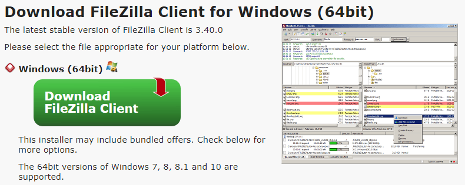

# Set Up

Before we launch into the server setup, let's quickly review where certain files are going to go:

## File Locations and Directory Structure

According to the [JuptyerHub docs](https://jupyterhub.readthedocs.io/en/stable/installation-basics.html):

The folks at JupyterHub recommend that we put all of the files used by JupyterHub into standard UNIX filesystem locations on our server:

* ```/srv/jupyterhub``` for all security and runtime files
* ```/etc/jupyterhub``` for all configuration files
* ```/var/log```  for log files

## Development tools

Before creating the server, a set of private/public SSH keys are needed. SSH keys can be created with [PuTTY Gen](https://winscp.net/eng/docs/ui_puttygen). PuTTY Gen is installed with a typical PuTTY installation. See [this post](https://pythonforundergradengineers.com/ssh-keys-with-putty.html) for details.

A SSH terminal program is needed to communicate with the server. On Windows 10, I use [PuTTY](https://www.putty.org/). See [this post](https://pythonforundergradengineers.com/ssh-keys-with-putty.html) for details. On MacOS and Linux, SSH from the command line works as well.


It is helpful to have an SFTP client to move large files back and forth between a local computer and the server. On Windows 10, I use [FileZilla](https://filezilla-project.org/).



Locally, I use the [Anaconda distribution of Python](https://www.anaconda.com/download/) and the [Anaconda Prompt](https://conda.io/docs/) to create virtual environments and run Python code.


This JupyterHub deployment runs on a [Digital Ocean](https://www.digitalocean.com/) virtual private server. Local development and testing was completed on a Windows 10 laptop and desktop. 


## Next Steps

The next step is to create a public-private SSH key pair with PuTTYgen. We'll use this public-private SSH key to log into the server with PuTTY.

<br>
