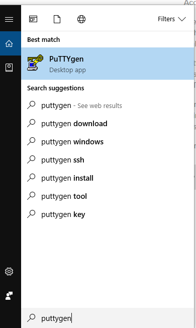
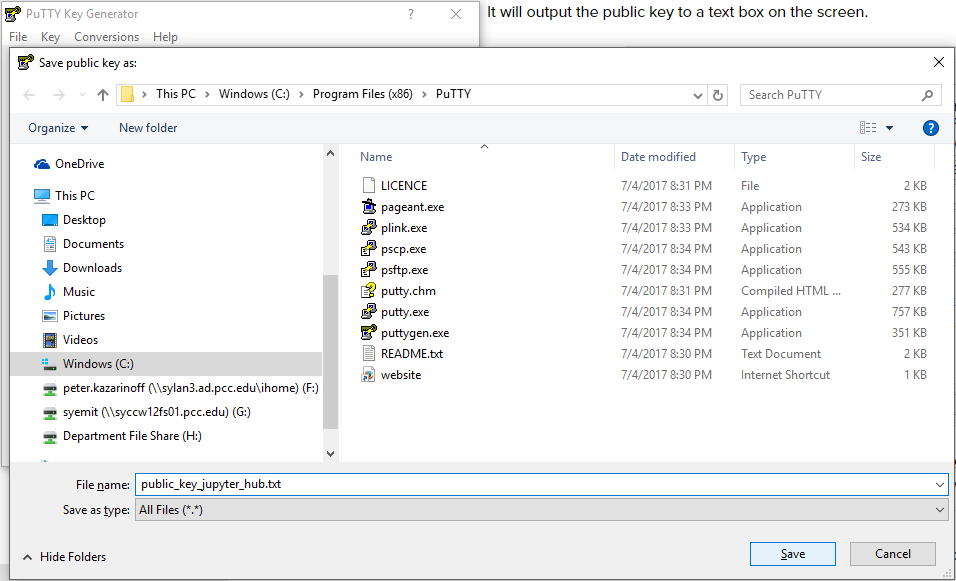

# Create SSH keys

SSH keys allow us to log into the cloud server which will run JupyterHub. SSH keys come in pairs, a private key and a public key. The public key will be stored on the JupyterHub server and the private key will stay on our local machine. 

[TOC]

## Why SSH keys, PuTTYgen and why do this first?

When I set up the server the first time, one of the initial server setup steps was to add SSH keys (so the server has the SSH key when it initialized). 

I tried to create and save the SSH keys to the Digital Ocean (the cloud server provider) dashboard so the SSH keys would be on the server when the server first started. But I goofed up somehow and the server started without any SSH keys. 

**It was a BIG PAIN adding SSH keys after the server started for the first time.** 

I ended up copying the public SSH key into pastebin.com, logging onto the server with the Digital Ocean console and used ```wget``` to bring a textfile of the SSH key from pastebin.com onto the server and then ```mv``` to copy the key name into the right location.

I'm pretty sure that pasting a public SSH key into pastebin.com is not the best way to initially set up a server. So to make sure that doesn't happen again, we are going to generate the SSH keys first and set up the server second. 

SSH keys are needed to use PuTTY (regular PuTTY not PuTTYgen) to log into the server. Since I'm working on Windows 10, using PuTTYgen (a program that comes with PuTTY that generates SSH keys) seems like the easiest solution. 

## Download PuTTY

I already have PuTTY installed on my Windows 10 machines at home and at work. The download link is below:

[Download PuTTY](https://www.putty.org/)

PuTTY seems to want you to install lots of extra stuff when you run the installer. I didn't install any of the "offers" that popped up during installation.


## Start PuTTYgen and create SSH key

I went through [this tutorial](https://www.digitalocean.com/community/tutorials/how-to-use-ssh-keys-with-putty-on-digitalocean-droplets-windows-users) about how to set up SSH keys on Windows 10 for Digital Ocean when I created the first SSH key.

Using the Windows start menu, open PuTTYgen (not regular PuTTY):




Use the following parameters

 * Type of key to generate: RSA
 * Number of bits in generated key: 2048

Then click [generate]


This brings up a dialog to move the mouse around the empty area to generate some randomness. This is my favorite part! Just move the mouse around the dialog box until the progress bar ends. Fun.


When the next screen pops up, right-click and copy the contents of the Public Key. We'll need the public key contents available to paste into the server's SSH ```authorized_keys``` file. Include the rsa line in the text copied to the clipboard.

## Save SSH public and private keys to Documents folder

In the [Actions] section click [Save public key] and click [Save private key]


Make sure to save both the public and the private keys. Save these keys to an accessible folder. The first time I generated SSH keys, I saved the keys in the default location and couldn't access them later. The second time I created SSH keys, I created a folder in the Documents folder called ssh-keys and saved the public and private keys in ```Documents\ssh-keys```. I saved the public key with the name: ```public_key_jupyter_hub.txt```. The Digital Ocean documentation recommends a ```.txt``` file extension for the public key (so you can open it and copy the contents). The private key should have a .ppk file extension.



## Copy the public key to clipboard

Before closing PuTTYgen, make sure to copy the contents of the Public Key to the clipboard. We'll need the public key contents when we create the server. Copy all of the contents of the public SSH key including the rsa line. 

## Summary

After completing these steps, we have a public and private SSH key pair saved in ```Documents\ssh-keys```. We also have the contents of the public SSH key saved to the clipboard.

## Next Steps

Next, we'll create a new server on Digital Ocean (called a _droplet_). Then we'll use the SSH keys we just created to log into the server and create a non-root sudo user.